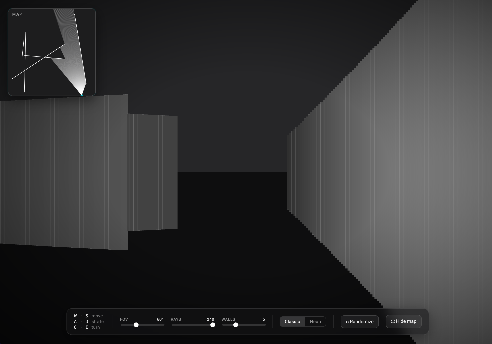

# React Raycasting

A first-person raycasting demo built in React. Walk around a procedural maze, watch the 2D top-down rays project into a 3D scene in real time, and tweak FOV, ray count, walls, and theme on the fly.



Based on the coding challenge by [The Coding Train](https://www.youtube.com/user/shiffman). This fork drops the p5.js dependency, writes the math by hand, and adds a fullscreen view with DOOM-style controls.

## Controls

| Key   | Action       |
| ----- | ------------ |
| `W` / `S` | move forward / back |
| `A` / `D` | strafe left / right |
| `Q` / `E` | turn left / right   |

Click into the page first so it has keyboard focus.

## How it works

- **Rays** are cast from the player across the configured FOV. Each ray is intersected against every wall segment; the closest hit is the visible surface.
- **3D projection** uses `height ∝ focalLength / distance` — the same perspective formula as DOOM. The focal length is derived from FOV, so wider FOV = shorter walls, like a fisheye lens pulled back.
- **Shading** falls off as `1 / (1 + distance · k)`, so far walls get darker smoothly without a hard cutoff.
- **Collision** is segment-vs-segment with slide-along-wall fallback, so you don't pass through walls when walking at an angle.

## Setup

```
yarn install
yarn dev
```

Then open http://localhost:3000.

## Stack

Next.js 13 · React 18 · TypeScript · Konva (canvas rendering) · styled-components.
